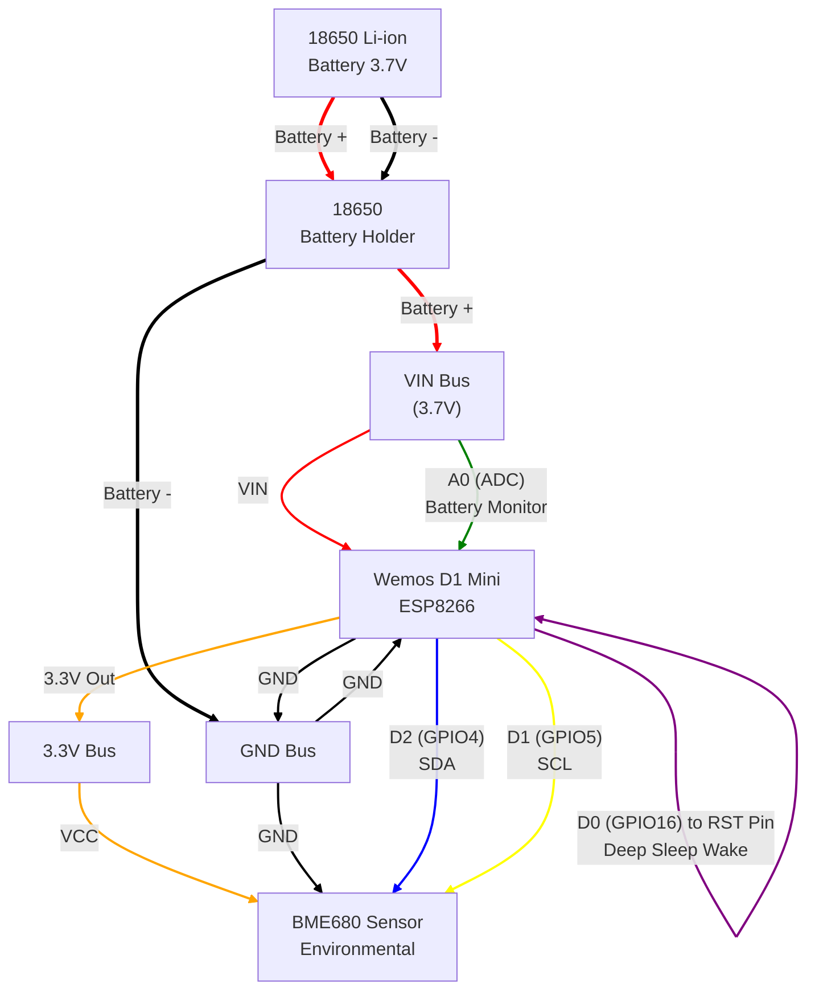

# Wiring Diagram - ESP Home Environmental Sensor

This diagram shows the electrical connections between the Wemos D1 Mini, BME680 sensor, and 18650 battery for the ESP Home environmental sensor project.

## Component Layout

## Pin Mapping Details

### Wemos D1 Mini Pinout
| Physical Pin | GPIO | Function | Connection |
|--------------|------|----------|------------|
| VIN | - | Power Input | 18650 Battery + |
| GND | - | Ground | 18650 Battery - |
| 3.3V | - | 3.3V Output | BME680 VCC |
| D1 | GPIO5 | I2C Clock | BME680 SCL |
| D2 | GPIO4 | I2C Data | BME680 SDA |
| D0 | GPIO16 | Deep Sleep Wake | RST Pin (REQUIRED for deep sleep) |
| RST | - | Reset | D0 Pin (REQUIRED for deep sleep) |
| A0 | ADC0 | Analog Input | Battery Voltage (optional) |

### BME680 Sensor Pinout
| BME680 Pin | Function | Connection |
|------------|----------|------------|
| VCC | Power (3.3V) | Wemos 3.3V |
| GND | Ground | Wemos GND |
| SDA | I2C Data | Wemos D2 (GPIO4) |
| SCL | I2C Clock | Wemos D1 (GPIO5) |

## Connection Notes

### Power Distribution
- **18650 Battery**: Provides 3.7V nominal (4.2V fully charged, 3.0V depleted)
- **VIN Pin**: Can accept 5-12V, has onboard regulator to 3.3V
- **Direct Connection**: Battery connects directly to VIN for maximum efficiency
- **Current Path**: Battery → VIN → Internal Regulator → 3.3V → BME680

### I2C Communication
- **Pull-up Resistors**: Most BME680 breakout boards include built-in 10kΩ pull-ups
- **Bus Speed**: Configured for 100kHz for reliable operation
- **Address**: BME680 typically uses 0x77 (some modules use 0x76)

### Deep Sleep Wake Connection (CRITICAL)
- **Required Connection**: D0 (GPIO16) MUST be connected to RST pin
- **Purpose**: Allows ESP8266 to wake itself from deep sleep after timer expires
- **Implementation**: Short jumper wire or PCB trace between D0 and RST pins
- **Without This**: Device will never wake from deep sleep and appear "dead"
- **Note**: This connection is specific to ESP8266; ESP32 handles this internally

### Battery Monitoring
- **Direct Monitoring**: A0 pin can read battery voltage through voltage divider
- **Voltage Divider**: May be needed if battery voltage exceeds 3.3V maximum for ADC
- **Alternative**: Monitor VIN directly if within ADC range

## Physical Assembly Tips

### Mounting Considerations
1. **Compact Layout**: Keep sensor away from heat-generating components
2. **Ventilation**: Ensure BME680 has access to ambient air
3. **Strain Relief**: Secure all wire connections
4. **Access**: Easy battery replacement without disassembly

### Wire Gauge Recommendations
- **Power (VIN, GND)**: 22-24 AWG for current capacity
- **I2C (SDA, SCL)**: 26-28 AWG sufficient for data lines
- **Deep Sleep (D0 to RST)**: 30 AWG or thin jumper wire
- **Total Length**: Keep I2C wires under 12 inches for reliability

### Connector Options
- **JST Connectors**: For removable battery connection
- **Pin Headers**: For breadboard prototyping
- **Direct Solder**: For permanent installation
- **Terminal Blocks**: For field serviceability
