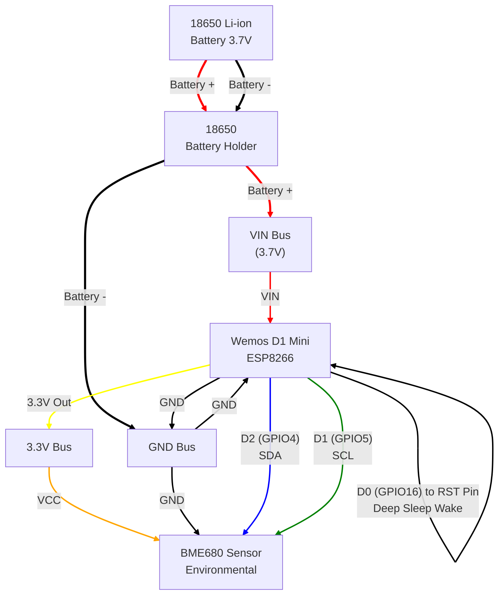
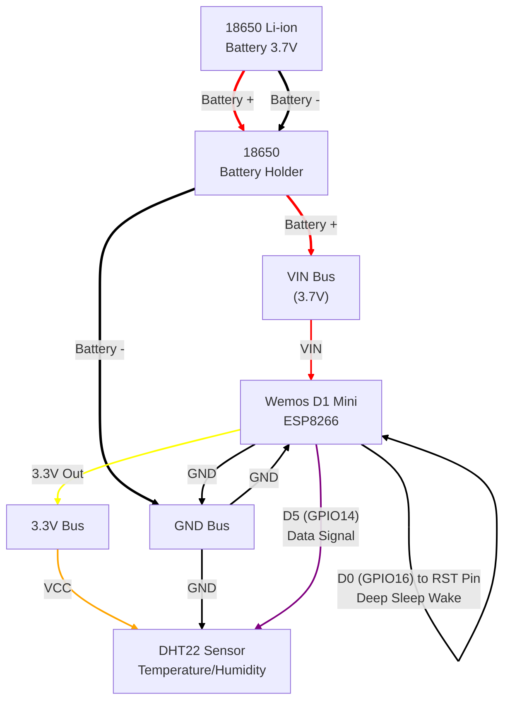

# Wiring Diagram - ESP Home Environmental Sensor

This diagram shows the electrical connections for the Wemos D1 Mini with environmental sensors (BME680 or DHT22) and 18650 battery.

## Component Layout - BME680 (I2C)

## Component Layout - DHT22 (Digital GPIO)

## Pin Mapping Details

### Wemos D1 Mini Pinout - BME680 Configuration
| Physical Pin | GPIO | Function | Connection |
|--------------|------|----------|------------|
| VIN | - | Power Input | 18650 Battery + |
| GND | - | Ground | 18650 Battery - |
| 3.3V | - | 3.3V Output | BME680 VCC |
| D1 | GPIO5 | I2C Clock | BME680 SCL |
| D2 | GPIO4 | I2C Data | BME680 SDA |
| D0 | GPIO16 | Deep Sleep Wake | RST Pin (REQUIRED for deep sleep) |
| RST | - | Reset | D0 Pin (REQUIRED for deep sleep) |

### Wemos D1 Mini Pinout - DHT22 Configuration
| Physical Pin | GPIO | Function | Connection |
|--------------|------|----------|------------|
| VIN | - | Power Input | 18650 Battery + |
| GND | - | Ground | 18650 Battery - |
| 3.3V | - | 3.3V Output | DHT22 VCC |
| D5 | GPIO14 | Digital Data | DHT22 Data (with pull-up) |
| D0 | GPIO16 | Deep Sleep Wake | RST Pin (REQUIRED for deep sleep) |
| RST | - | Reset | D0 Pin (REQUIRED for deep sleep) |

### BME680 Sensor Pinout
| BME680 Pin | Function | Connection |
|------------|----------|------------|
| VCC | Power (3.3V) | Wemos 3.3V |
| GND | Ground | Wemos GND |
| SDA | I2C Data | Wemos D2 (GPIO4) |
| SCL | I2C Clock | Wemos D1 (GPIO5) |

### DHT22 Sensor Pinout
| DHT22 Pin | Function | Connection |
|-----------|----------|------------|
| VCC | Power (3.3V) | Wemos 3.3V |
| GND | Ground | Wemos GND |
| Data | Digital Signal | Wemos D5 (GPIO14) with 4.7kΩ pull-up |

## Connection Notes

### Power Distribution (Both Sensors)
- **18650 Battery**: Provides 3.7V nominal (4.2V fully charged, 3.0V depleted)
- **VIN Pin**: Can accept 5-12V, has onboard regulator to 3.3V
- **Direct Connection**: Battery connects directly to VIN for maximum efficiency
- **Current Path**: Battery → VIN → Internal Regulator → 3.3V → Sensor

### BME680 I2C Communication
- **Pull-up Resistors**: Most BME680 breakout boards include built-in 10kΩ pull-ups
- **Bus Speed**: Configured for 100kHz for reliable operation
- **Address**: BME680 typically uses 0x77 (some modules use 0x76)
- **Pins**: D1 (GPIO5) = SCL, D2 (GPIO4) = SDA

### DHT22 Digital Communication
- **Pull-up Resistor**: Requires 4.7kΩ pull-up resistor on data line (D5/GPIO14)
- **Communication Protocol**: Proprietary single-wire digital protocol
- **Signal Timing**: Timing is critical; ESPHome handles this automatically
- **Reading Interval**: Typically takes 2-3 seconds per reading
- **Temperature & Humidity Only**: Does not provide pressure or gas resistance

### Deep Sleep Wake Connection (CRITICAL)
- **Required Connection**: D0 (GPIO16) MUST be connected to RST pin
- **Purpose**: Allows ESP8266 to wake itself from deep sleep after timer expires
- **Implementation**: Short jumper wire or PCB trace between D0 and RST pins
- **Without This**: Device will never wake from deep sleep and appear "dead"
- **Note**: This connection is specific to ESP8266; ESP32 handles this internally

## Physical Assembly Tips

### Mounting Considerations
1. **Compact Layout**: Keep sensor away from heat-generating components
2. **Ventilation**: Ensure sensor has access to ambient air
   - **BME680**: Requires good ventilation for accurate gas resistance readings
   - **DHT22**: More tolerant; simple placement works fine
3. **Strain Relief**: Secure all wire connections
4. **Access**: Easy battery replacement without disassembly
5. **Pull-up Resistor (DHT22)**: Keep 4.7kΩ pull-up resistor close to data pin

### Wire Gauge Recommendations
- **Power (VIN, GND)**: 22-24 AWG for current capacity
- **BME680 I2C (SDA, SCL)**: 26-28 AWG sufficient for data lines
- **DHT22 Data**: 26-28 AWG with inline pull-up resistor
- **Deep Sleep (D0 to RST)**: 30 AWG or thin jumper wire
- **Total Length**: Keep sensor wires under 12 inches for reliability

### Connector Options
- **JST Connectors**: For removable battery connection
- **Pin Headers**: For breadboard prototyping
- **Direct Solder**: For permanent installation
- **Terminal Blocks**: For field serviceability

### Sensor Comparison

| Feature | BME680 | DHT22 |
|---------|--------|-------|
| Communication | I2C | Digital (GPIO) |
| Measurements | Temp, Humidity, Pressure, Gas | Temp, Humidity only |
| I2C Address | 0x76 or 0x77 | N/A |
| Pins Required | 4 (VCC, GND, SDA, SCL) | 3 (VCC, GND, Data) |
| Pull-up Resistor | Built-in (usually) | External 4.7kΩ required |
| Accuracy | ±0.75°C, ±3%RH | ±2°C, ±5%RH |
| Cost | ~$20-30 | ~$5-10 |
| Best For | Advanced air quality monitoring | Simple temp/humidity tracking |
